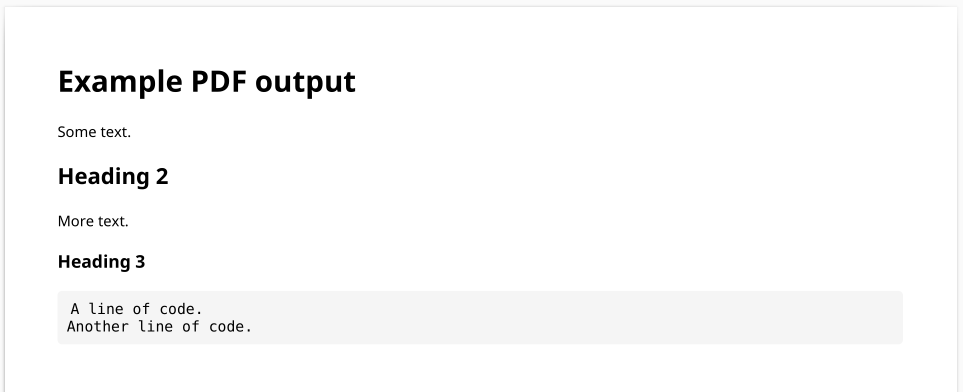
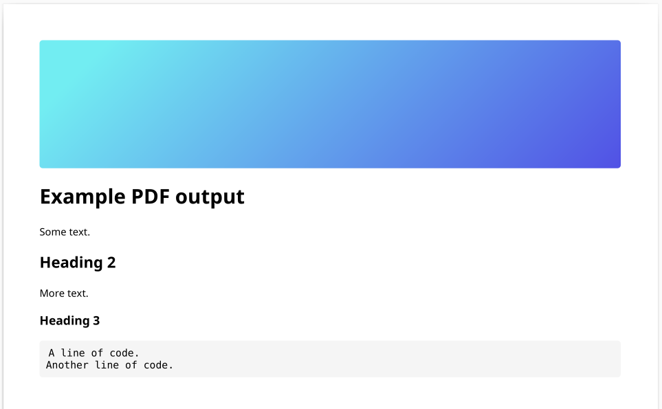
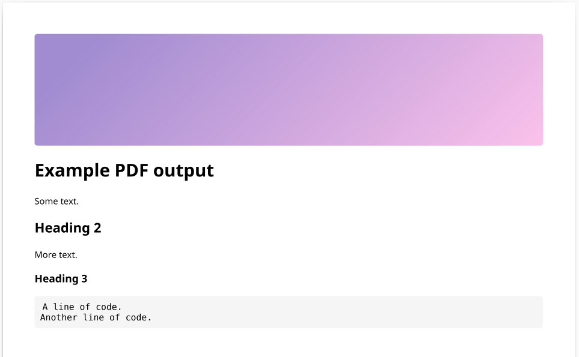
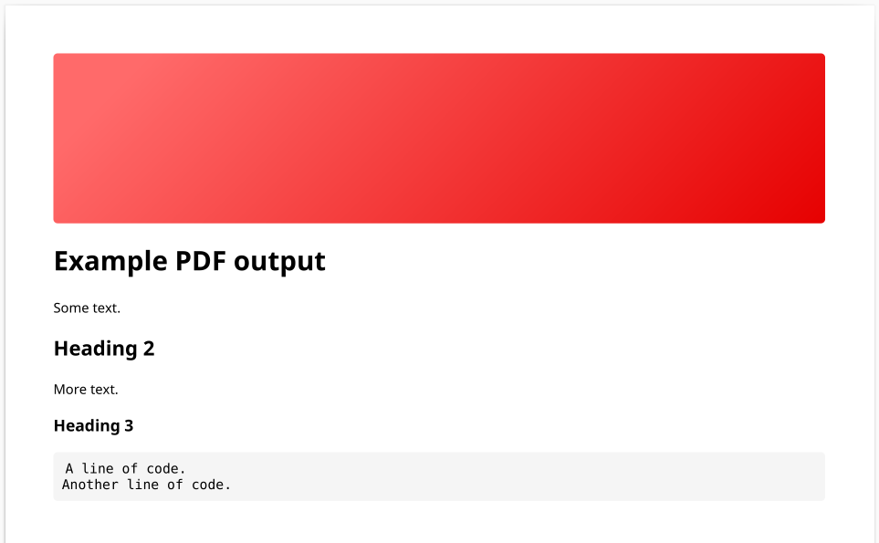

# repo2pdf

Simple utility to generate a PDF file from the contents of a GitHub repository.

### Features

- Custom code block style with set background and fonts
- Basic custom header styles

> [!NOTE]
> This utility aims to produce a PDF with markdown styling.

## Usage

### Quick start

```
. setup.sh
python3 repo2pdf.py --repo_path ~/Documents/repository/ --pdf_file_path ~/Downloads/output.pdf --style blue
```

### Detailed

1. Install apt packages in `apt-packages.txt`
2. Create and activate a Python `venv` (optional but recommended)
3. Install Python packages in `requirements.txt`
4. Run `python3 repo2pdf.py --help` for a full list of arguments


## Examples

### Blank header



### Blue header



### Purple header



### Red header

